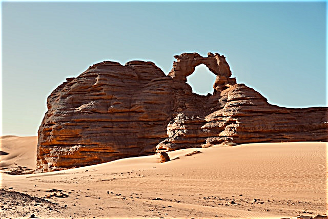
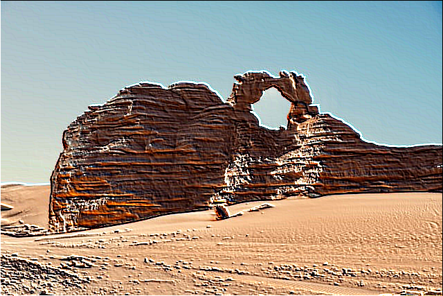

# ImageWrench

ImageWrench is a lightweight, cross-platform bitmap (.bmp) image editor. Supporting a variety of bitmap formats and provides tools for image manipulation, including customizable convolution kernels of various sizes for effects such as blur, sharpen, and edge detection, as well as adjust color properties like hue, saturation, and brightness.

## Getting Started

### Compatibility

The program works on Windows, Linux and Mac. It is tested on Windows 11, Ubuntu 22 and macOS 15.

### Installation

1. **Clone the repository:**

    ```
    git clone https://github.com/Cactooz/ImageWrench.git
    ```

    ```
    cd ImageWrench
    ```

2. **Build the project:**

    ```
    make
    ```

    _This command compiles all source files with the correct flags and outputs the executable to the `bin` directory._

### Usage

1. **Run ImageWrench:**

    ```
    ./bin/ImageWrench <image_path> <output_path>
    ```

    Replace `<image_path>` with the path to a valid bitmap image file.  
    Replace `<output_path>` with the path to the output bitmap image file. (Optional)

2. **Navigation & Controls:**

    - Use the **arrow keys** or **WASD** to move through the menu.
    - Press **Enter** to select an option or apply a filter.
    - After editing, select **Save & Exit** to output the modified image.

3. **Output:**

    The modified image will be saved in the original location with `-modified` appended to the original file name before the extension. Alternatively, if the `<output_path>` argument is provided, the image will be saved at the specified location.

## Examples

| Operation        | Example Output                                            | Options / Notes                             |
| ---------------- | --------------------------------------------------------- | ------------------------------------------- |
| Box Blur         |          | Adjustable kernel size, square box blurring |
| Gaussian Blur    |     | Adjustable kernel size, smooth blurring     |
| Sharpen          |           | Adjustable kernel size, hard sharpening     |
| Gaussian Sharpen |  | Adjustable kernel size, smooth sharpening   |
| Emboss           |            | Adjustable kernel size with 4 directions    |
| Outline          |           | Adjustable kernel size                      |
| Sobel Edge       |             | Adjustable kernel size with 4 directions    |
| Invert Colors    |            | Inverts all colors                          |
| Grayscale        |         | Converts to grayscale                       |
| Brighten         |          | Adjustable brightness, automatic clamping   |
| Darken           |            | Adjustable brightness, automatic clamping   |
| Saturate         |          | Adjustable saturation, automatic clamping   |
| Desaturate       |        | Adjustable saturation, automatic clamping   |
| Hue +            |          | Adjustable hue, automatic rollover          |
| Hue -            |         | Adjustable hue, automatic rollover          |
